# StockPilot — Explainable Warehouse Replenishment OS

Система автоматического и объяснимого расчёта заказов поставщикам для пополнения распределительных складов дистрибьютора электротехники **ТОО «Электрокомплект» (ekt.kz)**.

StockPilot объединяет историю продаж, текущие остатки, товары в пути, логистические сроки (Lead Time), минимальные партии (MOQ), кванты упаковки и периоды дефицита (stockouts) для ответа на ключевой вопрос закупщика: **что, сколько и почему нужно заказать прямо сейчас?**

---

## ⚡️ Быстрый запуск в 1 команду (Docker)

```bash
docker compose up --build
```

- **Frontend Dashboard:** [http://localhost:5173](http://localhost:5173)
- **Backend Swagger API:** [http://localhost:8000/docs](http://localhost:8000/docs)
- **Health Check:** [http://localhost:8000/health](http://localhost:8000/health)

---

## 🛠 Локальный запуск для разработки

### 1. Backend (FastAPI + Python 3.12/3.13)

```powershell
cd backend
python -m venv .venv
.\.venv\Scripts\Activate.ps1
pip install -r requirements.txt
uvicorn app.main:app --reload --port 8000
```

### 2. Frontend (React + Vite + TypeScript)

```powershell
cd frontend
npm install
npm run dev
```

Откройте [http://localhost:5173](http://localhost:5173). В приложении доступны:
1. Кнопка **«⚡️ ekt.kz Dataset (Казахстан)»** — мгновенная загрузка реального датасета ТОО «Электрокомплект» с расчётом заказов и бюджета в тенге (₸).
2. Кнопка **«💥 Аномалии (Stress Test)»** — стресс-тест на 20 294 транзакциях с 8 реальными типами коммерческих аномалий (тендеры, скачки цен меди, ЧС/шторм, ошибки операторов 1С, дефициты, неликвиды, каннибализация).
3. Кнопка **«↻ Synthetic demo»** — синтетический эталонный сценарий (105 SKU, 3 склада, 5 поставщиков).
4. Раздел **«Data Intake»** — загрузка файлов по отдельности или книги Excel целиком (`ekt_sales_and_stock_history.xlsx` или `ekt_extreme_anomalies_sales_and_stock.xlsx`, 5 листов в 1 клик).

---

## 📐 Архитектура и математический аппарат

StockPilot строго следует пяти ключевым критериям Must Have ТЗ хакатона:

```mermaid
flowchart LR
    A[Excel / CSV: продажи, остатки, пути, дефицит, поставщики] --> B[Валидация и нормализация]
    B --> C[Календарный спрос]
    C --> D[Возвраты, прямые отгрузки, выбросы, lost demand]
    D --> E[Сезонный прогноз и тренд]
    E --> F[Lead Time + Safety Stock - остаток - своевременный inbound]
    F --> G[MOQ + кратность + минимальная сумма]
    G --> H[FastAPI: рекомендации и объяснения]
    H --> I[React: проверка и правка закупщиком]
    I --> J[SQLite: утверждение и история версий]
    J --> K[CSV / Excel: итоговый заказ]
```



Верхняя панель показывает дату последней продажи в загруженных данных, а не дату запуска приложения: это помогает заметить устаревший срез до утверждения заказа.

### 1. Формула расчёта потребности
$$\text{Demand during Lead Time} = \text{Lead Time (days)} \times \text{Average Daily Demand} \times \text{Seasonality} \times (1 + \text{Trend})$$
$$\text{Safety Stock} = Z \times \sigma_{\text{daily}} \times \sqrt{\text{Lead Time}} \quad (Z = 1.65 \text{ для 95\% уровня сервиса})$$
$$\text{Net Requirement} = \max(0, \text{Demand during Lead Time} + \text{Safety Stock} - \text{Available Stock} - \text{Inbound Arriving within Lead Time})$$

### 2. Учёт ограничений поставщиков (MOQ и квант упаковки)
- Если $\text{Net Requirement} > 0$ и задан $\text{MOQ}$: $\text{Order} = \max(\text{Net Requirement}, \text{MOQ})$.
- Любой положительный заказ (в том числе при `Pack = 1`) округляется вверх: $\text{Order} = \lceil \frac{\max(\text{Net Requirement}, \text{MOQ})}{\text{Package Size}} \rceil \times \text{Package Size}$.
- Если поставщик задаёт минимальную сумму заказа, перед округлением применяется также нижняя граница `Minimum Order Value / Unit Cost`. Закупщик не может утвердить итог ниже этой суммы.

### 3. Фильтрация разовых выбросов (Robust MAD)
Алгоритм использует медианное абсолютное отклонение (Median Absolute Deviation, MAD) вместо чувствительного к выбросам стандартного отклонения:
$$\text{MAD} = \text{median}(|x_i - \text{median}(X)|), \quad \text{Modified Z} = 0.6745 \times \frac{x_i - \text{median}(X)}{\text{MAD}}$$
Сначала агрегируются все строки одного клиента за день, SKU и склад. Это выявляет и раздробленный заказ на 4800 м. Разовые оптовые партии (в стресс-датасете — 8500 м от `CLNT-BI-GROUP-TENDER`) исключаются из регулярного прогноза, но сохраняются в журнале аномалий (**Audit Trail**).

### 4. Реконструкция упущенного спроса (Stockout Compensation)
История разворачивается в календарные дни: отсутствие строки продаж в день дефицита означает ноль наблюдаемых продаж, а не отсутствие даты. Пересекающиеся периоды объединяются логической маской, и упущенный спрос оценивается по медиане дней без дефицита без двойного счёта.

### 5. Сезонность и тренд
- Выявление внутринедельной и помесячной сезонности (например, пик светотехники +65% в зимние месяцы и строительный пик кабельной продукции летом).
- Оценка тренда после удаления месячной сезонной волны; прогноз зимнего пика не гасится ошибочным «падением» после прошлого зимнего сезона.

### 6. Учёт товаров в пути (In-Transit) и бюджета (KZT)
- Из потребности вычитаются только товары с ожидаемым прибытием не позже конца Lead Time. Поставка через год не покрывает ближайшую потребность.
- Риск дефицита до прибытия ближайшей поставки оценивается по физическому доступному остатку: входящая партия не маскирует сегодняшнюю пустую полку в индикаторе `CRITICAL`.
- Для каждой строки и поставщика рассчитывается общая сумма закупки в казахстанских тенге (**₸ KZT**).
- Стресс-данные: сторно/возврат сверяется с исходной накладной того же клиента за последние 7 дней; транзитные отгрузки напрямую клиенту исключаются из спроса склада.
- Утверждение ручной правки проверяет MOQ и Pack; статус, окончательное количество и бюджет сохраняются при пересчёте и перезапуске. При изменении исходных данных прежнее утверждение архивируется, а новая рекомендация становится черновиком.

---

## 🧪 Тестирование

Комплексный набор автоматических тестов проверяет математику и валидацию:

```powershell
cd backend
pytest
```

Дополнительная независимая приёмка (формула, граничные случаи, API, импорт и жизненный цикл): `python qa/run.py` из корня репозитория. Стресс-книга и паспорт аномалий находятся в `backend/data/`.

**Покрытие тестов (`tests/test_replenishment.py`):**
1. Влияние текущих остатков на снижение объёма закупки.
2. Корректное вычитание товаров в пути (In-Transit).
3. Изоляция выбросов с сохранением в реестре аудита.
4. Гарантия неотрицательности рекомендаций.
5. Соблюдение квантов упаковки и минимальной партии (MOQ).
6. Восстановление упущенного спроса при дефиците.
7. Нормализация русскоязычных заголовков партнёра (Артикул, Количество, Склад и т.д.).
8. Корректный расчёт бюджета в KZT.

---

## 🔌 API Endpoints

| Метод | Путь | Описание |
| :--- | :--- | :--- |
| `GET` | `/health` | Проверка жизнеспособности сервиса |
| `POST` | `/api/data/load-ekt` | Загрузка и расчёт реального датасета ТОО «Электрокомплект» |
| `POST` | `/api/data/load-anomalies` | Загрузка и расчёт датасета с экстремальными аномалиями (48 аномалий, 20 тыс. строк) |
| `POST` | `/api/data/upload-workbook` | Загрузка единой 5-листовой книги Excel (.xlsx) |
| `POST` | `/api/data/upload/{dataset}` | Загрузка отдельного датасета (sales, stock, transit, suppliers, stockouts) |
| `POST` | `/api/data/demo` | Загрузка синтетического сценария |
| `POST` | `/api/recommendations/calculate` | Перерасчёт с настраиваемыми параметрами (Z, threshold, safety days) |
| `GET` | `/api/recommendations` | Получение списка рекомендаций с фильтрами |
| `GET` | `/api/analytics/{sku}` | Детализированные точки спроса, прогноз и дефицит для графика |
| `GET` | `/api/outliers` | Реестр выявленных аномалий и выбросов |
| `POST` | `/api/orders/{id}/adjust` | Ручная корректировка количества закупщиком |
| `POST` | `/api/orders/{id}/approve` | Утверждение заказа в производство/закупку |
| `GET` | `/api/orders/history` | Архив прежних решений после изменения исходных данных |
| `GET` | `/api/orders/export` | Экспорт итогового плана закупок в Excel / CSV |
